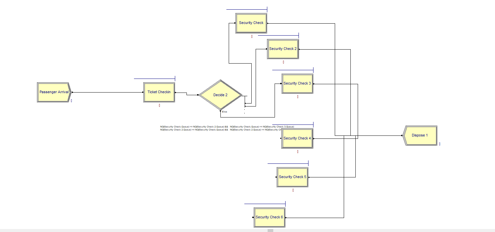

```{r setup, include=FALSE}
knitr::opts_chunk$set(echo = TRUE)

if (Sys.info()[[1]] == "Windows" & Sys.info()['user'] == 'gambrel') {
  setwd("E:/GoogleDrive/edx/6501x/week6")
} else if (Sys.info()['user'] == "robert.gambrel") {
  setwd("C:/Users/robert.gambrel/Documents/edx")
} else if (Sys.info()[[1]] == "Linux") {
  setwd("~/Documents/edx/6501x/week6")
}

```

```{r} 

pacman::p_load(dplyr, tidyr, magrittr, readr, purrr, stats, outliers, 
               lubridate, ggplot2, glmnet, FrF2, tibble, broom, mice, kknn)
set.seed(42)
```

# Q1

I tried multiple configurations of the passenger check-in process to minimize resources. The first bottleneck was the ticketing gate checkin. If I included less than 4 agents here, the process had a mean throughput time of 19 minutes, even with maximum security gates allowed. I next iteratively reduced the security capacity - the image below shows the point at which security was insufficient to meet the demands of the assignment. I started with 6 security gates and removed them one at a time to find the minimum necessary to keep wait times low. Under the 3-queue system below, mean throughput time in this model was 22 minutes. Under the conditions we chose in the model, I therefore needed 4 ticketing agents and 4 security lines to consistently achieve a mean passenger wait time of 15 minutes or less.


# Q2
```{r}
cancer <- read_csv('breast-cancer-wisconsin.data.txt', na = '?',
                   col_types = c('idddddddddi'),
                   col_names =  c('sample_id', 'clump_thickness', 'cell_size_uniformity',
                   'cell_shape_uniformity', 'marginal_adhesion', 'epithelial_cell_size',
                   'bare_nuclei', 'bland_chromatin', 'normal_nucleoli', 'mitoses', 'class'))

names(cancer) <- c('sample_id', 'clump_thickness', 'cell_size_uniformity',
                   'cell_shape_uniformity', 'marginal_adhesion', 'epithelial_cell_size',
                   'bare_nuclei', 'bland_chromatin', 'normal_nucleoli', 'mitoses', 'class')

cancer$malignant <- ifelse(cancer$class == 4, 1, 0)

cancer$class <- NULL

sum(complete.cases(cancer))
summary(cancer)

```

I first do mean imputation. Since each predictor column is continuous, I do not need to worry about modal imputation. Even though `bare_nuclei` is the only column with missing values, my function will check every column except the `sample_id` variable and the `malignant` outcome variable.

```{r}
# duplicate dataset, which will be updated with mean values where missing
mean_imputed <- cancer

na.assign <- function(col, val) {
  col[is.na(col)] <- val
  return(col)
}

for (var in names(mean_imputed)[2:10]) {
  # column mean of non-missing data
  mean_val = mean(mean_imputed[[var]], na.rm = T)
  
  # update if missing
  mean_imputed[, var] <- na.assign(mean_imputed[,var], mean_val)
  
}
sum(complete.cases(mean_imputed))
summary(mean_imputed)
```
There are no entries of `bare_nuclei` that are missing now. The mean stays the same, which we woul dexpect after mean imputation.

I next use the `mice` package to do regression imputation. First, I use the predicted value with no error.

```{r}
predicted_imputation <- mice(cancer, m = 1, method = 'norm.predict')
predicted_imputation_values <- complete(predicted_imputation)
summary(predicted_imputation_values)
sd(predicted_imputation_values$bare_nuclei)
```

Next, I allow for some prediction error around the imputed value, based on the model's standard error.

```{r}
predicted_imputation_w_err <- mice(cancer, m = 1, method = 'norm')
predicted_imputation_w_err_values <- complete(predicted_imputation_w_err)
summary(predicted_imputation_w_err_values)
sd(predicted_imputation_w_err_values$bare_nuclei)

```

I will fit a KNN classifier for each imputation type. First, for mean imputation.

```{r}

trained <- train.kknn(malignant ~ ., mean_imputed[, 2:11], kmax = 30,
                      kernel = c("rectangular", "triangular", "epanechnikov",
                                 "gaussian", "rank", "optimal"),
                      distance = 2)
trained$best.parameters
plot(trained)

# best model to balance accuracy w/ simplicity
cv <- cv.kknn(malignant ~ ., mean_imputed[, 2:11], 
              k = 6, kernel = 'gaussian', scale = T)

sum(cv[[1]][,1] == round(cv[[1]][,2])) / 699
```

For regression imputation with no error:

```{r}

trained <- train.kknn(malignant ~ ., predicted_imputation_values[, 2:11], kmax = 30,
                      kernel = c("rectangular", "triangular", "epanechnikov",
                                 "gaussian", "rank", "optimal"),
                      distance = 2)
trained$best.parameters
plot(trained)

# best model to balance accuracy w/ simplicity
cv <- cv.kknn(malignant ~ ., predicted_imputation_values[, 2:11], 
              k = 12, kernel = 'gaussian', scale = T)

sum(cv[[1]][,1] == round(cv[[1]][,2])) / 699

```

For regression imputation with error added to the predicted imputed values:

```{r}

trained <- train.kknn(malignant ~ ., predicted_imputation_w_err_values[, 2:11], kmax = 30,
                      kernel = c("rectangular", "triangular", "epanechnikov",
                                 "gaussian", "rank", "optimal"),
                      distance = 2)
trained$best.parameters
plot(trained)

# best model to balance accuracy w/ simplicity
cv <- cv.kknn(malignant ~ ., predicted_imputation_values[, 2:11], 
              k = 13, kernel = 'gaussian', scale = T)

sum(cv[[1]][,1] == round(cv[[1]][,2])) / 699

```

Of the 3, the model with the best predictive accuracy is the regression imputation with error.

We can also drop any of the original values that were missing any data and create a model:

```{r}
cancer_no_na <- cancer[complete.cases(cancer),]

trained <- train.kknn(malignant ~ ., cancer_no_na[, 2:11], kmax = 30,
                      kernel = c("rectangular", "triangular", "epanechnikov",
                                 "gaussian", "rank", "optimal"),
                      distance = 2)
trained$best.parameters
plot(trained)

# best model to balance accuracy w/ simplicity
cv <- cv.kknn(malignant ~ ., cancer_no_na[, 2:11], 
              k = 10, kernel = 'gaussian', scale = T)

sum(cv[[1]][,1] == round(cv[[1]][,2])) / 683
```
Here, the model has a slightly lower predictive power.

Finally, we can include a dummy for missing values and run the model then:

```{r}
cancer_na_interacted <- cancer
cancer_na_interacted$bare_nuclei[is.na(cancer$bare_nuclei)] <- 0
cancer_na_interacted$interaction_dummy <- 0
cancer_na_interacted$interaction_dummy[is.na(cancer$bare_nuclei)] <- 1

for (var in names(cancer_na_interacted)[2:10]) {
  cancer_na_interacted[, paste0(var, '_interacted')] <- 
    cancer_na_interacted[, var] * cancer_na_interacted$interaction_dummy
}


trained <- train.kknn(malignant ~ ., cancer_na_interacted[, c(2:21)], kmax = 30,
                      kernel = c("rectangular", "triangular", "epanechnikov",
                                 "gaussian", "rank", "optimal"),
                      distance = 2)
trained$best.parameters
plot(trained)

# best model to balance accuracy w/ simplicity
cv <- cv.kknn(malignant ~ ., cancer_na_interacted[, 2:21], 
              k = 25, kernel = 'gaussian', scale = T)

sum(cv[[1]][,1] == round(cv[[1]][,2])) / 699
```
This model assigns 0 to all missing values and adds a dummy indicating whether a row was imputed. It then interacts this dummy with each predictor variable. The model outperforms the one dropping all NA rows, but it isn't quite as good as the one that used regression imputation.

# Q3

My wife and I usually cook dinner together, but sometimes we get in each other's way in the small kitchen, and sometimes one of us is busy with the kids and can't help cook. We might try optimizing the dinner preparation process to output the best meal using only 1 chef in the kitchen. Variables would be raw ingredients and perhaps which cooking tools to use (pots, pans, oven, grill); constraints would be maximum stovetop and oven space and preparer time, as well as a budgetary constraint; the output would be meal quality, which ideally would factor in meal variety over time.

